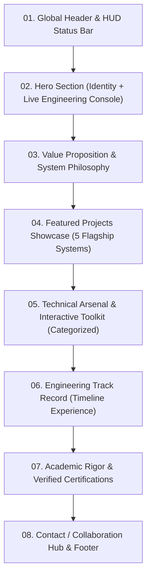
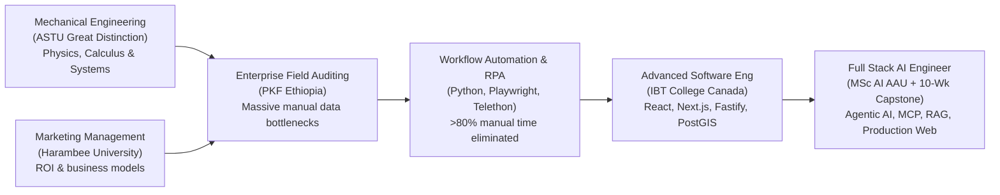
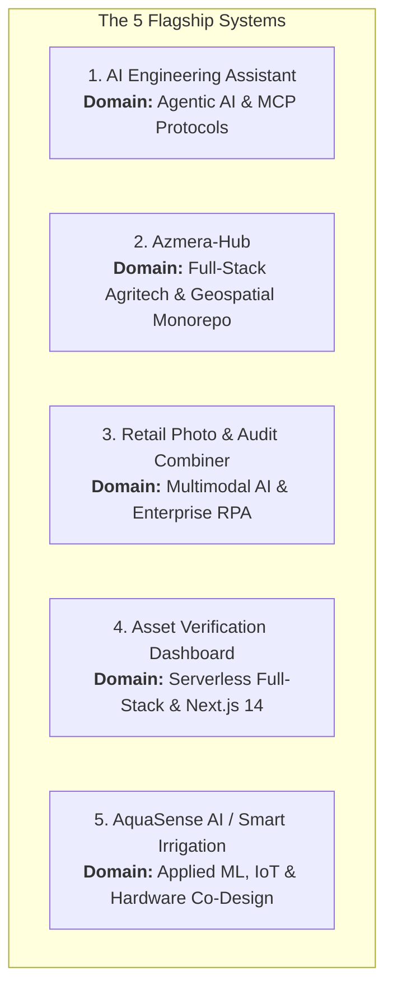
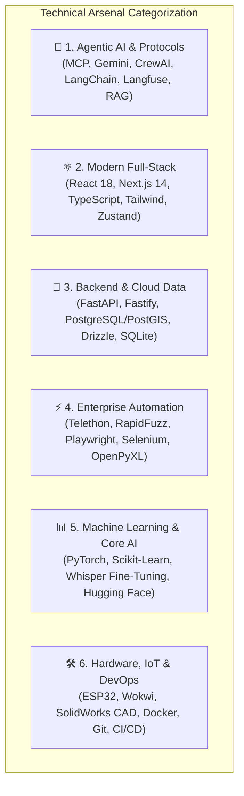

# Portfolio Architecture & Content Strategy Report
**Project:** Daniel Basaznew — Personal Portfolio Website  
**Target Professional Title:** Full Stack AI Engineer  
**Stage:** Step 2 of 10 — Information Architecture & Content Blueprint  
**Primary Source of Truth:** Portfolio Intelligence Report (Step 1 Audit)  
**Implementation Target:** React Single-Page Application (SPA)

---

## Executive Summary & Strategic Directive

This document establishes the strategic, narrative, and architectural blueprint for Daniel Basaznew’s personal portfolio website. 

The primary objective is to position Daniel decisively as a **Full Stack AI Engineer** capable of designing, building, hardening, and deploying both **autonomous AI systems (Agentic AI, MCP, RAG)** and **production-grade full-stack web applications (Next.js, React, TypeScript, serverless backends)**.

The design philosophy draws high-level aesthetic inspiration from the technical precision, engineering telemetry, and dark-mode elegance of top-tier developer portfolios (such as `azhar.com.pk`), but implements a completely **original visual identity and content architecture** rooted in Daniel's verified achievements.

---

## 1. Brand Positioning

### 1.1 What Daniel Should Be Known For
Daniel must be known as a **builder who ships resilient AI systems that survive production**. He is not a prompt wrapper creator or a notebook-bound data scientist; he is an engineer who bridges:
- Complex agentic orchestration (tool calling, dynamic context, protocol compliance)
- Modern type-safe full-stack web architectures (React, Next.js, TypeScript, PostgreSQL)
- Real enterprise workflow automation with proven operational ROI

### 1.2 The Strongest Technical Identity
His strongest technical identity is **Protocol-Driven Autonomous Agents & Production AI Engineering**:
- Building systems that communicate via the **Model Context Protocol (MCP)**
- Implementing defensive multi-layer guardrails, runaway tool-loop circuit breakers, and deterministic SQLite connection pooling
- Integrating distributed observability and real-time cost telemetry using **Langfuse**
- Grounding knowledge via multi-source RAG (ChromaDB, SentenceTransformers) and multi-agent coordination (CrewAI, LangChain)

### 1.3 How Agentic AI Connects with Full-Stack Development
In modern software engineering, AI cannot exist in isolation. Daniel's profile demonstrates the critical bridge:
- **The Intelligent Core:** Autonomous agents reasoning over complex tools, schemas, and vector stores.
- **The Interactive Surface:** High-performance React and Next.js interfaces delivering low-latency streaming states, dynamic filtering, and intuitive human-in-the-loop controls.
- **The Enterprise Backbone:** Fastify/FastAPI REST microservices, serverless PostgreSQL with Drizzle ORM, and PostGIS geospatial pipelines.

### 1.4 How Mechanical Engineering & Marketing Management Strengthen the Profile
- **Mechanical Engineering (ASTU, Great Distinction):** Instills physical-world systems thinking, rigorous mathematical foundations (Numerical Methods A+), and disciplined hardware-software co-design (CAD, embedded ESP32, fluid layouts).
- **Marketing Management (Harambee, CGPA 3.70):** Provides a commercial edge. Daniel understands unit economics, user conversion, operational bottlenecks, and business ROI. He builds software that solves measurable business problems.

### 1.5 What Makes the Profile Technically Distinctive
1. **Production Hardening:** While most agent demos loop infinitely or fail silently, Daniel implements regex validation, circuit breakers, semantic cache gating, and automated test suites (42+ unit/integration tests).
2. **Real Enterprise Impact:** Automated nationwide retail promotional audit operations at PKF Ethiopia, reducing manual workload by over 80% across 25+ regional channels.
3. **Emerging Market & Dialectal AI:** Fine-tuning OpenAI Whisper on the low-resource Amharic Shewa dialect, and developing Azmera-Hub for Ethiopian agricultural logistics.

---

### Core Brand Statements

> **Primary Positioning Statement:**  
> *"Full Stack AI Engineer architecting production-grade autonomous agent systems, high-performance web applications, and enterprise workflow automation pipelines."*

> **Short Professional Tagline:**  
> *"Building hardened AI agents and modern full-stack systems that survive production."*

### Supporting Positioning Themes
1. **Protocol-Native Agentic Architectures:** Standardized autonomous tool execution via Anthropic’s Model Context Protocol (MCP), ReAct loops, and multi-agent teams.
2. **Full-Stack Type Safety & Velocity:** End-to-end full-stack development using Next.js 14, React 18, TypeScript, Drizzle ORM, and Fastify/FastAPI.
3. **Enterprise Reliability & Observability:** Production defense with regex guardrails, semantic caching, circuit breakers, and Langfuse distributed token tracing.
4. **Interdisciplinary Engineering Depth:** Rooted in Mechanical Engineering rigor and Marketing Management business perspective.

---

## 2. Website Information Architecture

The website will be a cohesive, high-density **Single-Page React Application (SPA)** with smooth anchor scrolling, dynamic URL hash routing, and an interactive telemetry HUD.



### Detailed Section Breakdown

| Section # & Name | Purpose | Primary Content to Show | Information to Hide / Keep Secondary |
| :--- | :--- | :--- | :--- |
| **01. Navigation & HUD Status** | Instant technical credibility & persistent navigation | Monogram mark (`DB`), live availability badge (`● Available for AI & Full-Stack Roles`), section links (`about`, `projects`, `skills`, `experience`, `contact`), GitHub link. | Cluttered dropdowns, generic marketing links, unverified claims. |
| **02. Hero Section** | 5-second hook establishing title, stack, and production mindset | High-impact headline, dynamic terminal subtitle, value proposition, quick metrics (10-Week Agent Journey, 42+ Automated Tests, 80%+ Enterprise Workload Cut, ASTU Great Distinction), CTAs, and an **Interactive Engineering HUD/Console** displaying live agent telemetry. | Generic greetings ("Hello I'm Daniel"), stock graphics, long biographical paragraphs. |
| **03. About / Convergence Narrative** | Explains the transition and interdisciplinary advantage | Concise narrative showing the convergence: Mechanical Engineering + Marketing $\rightarrow$ Enterprise Automation $\rightarrow$ Advanced Software Development $\rightarrow$ MSc AI & Agentic Systems. Focus on systems discipline. | Transcripts, mundane university coursework, unrelated junior tasks. |
| **04. Featured Projects** | Concrete proof of capability across 5 key engineering domains | 5 curated flagship projects with uniform architecture: 3-metric KPI header, problem/solution, technical highlights, tech pills, repo/demo links, visual UI/telemetry card. | Do not dump all 18 GitHub repositories; hide low-complexity tutorial assignments. |
| **05. Technical Arsenal & Skills** | Categorized, evidence-grounded competence display | 6 logical skill categories with visual tiering (Core Agentic/AI, Modern Frontend, Backend/Databases, Automation/RPA, DevOps/Infra, IoT/Hardware). | Arbitrary percentage progress bars (e.g. "Python 85%"), self-rating meters. |
| **06. Engineering Experience** | Demonstrates career progression, autonomy, and business impact | Curated timeline (PKF Ethiopia, IBT-Qiyas Full Stack Academy, Heineken Ethiopia, Twinkle Technology, CodSoft). Highlights engineering metrics and technical problem-solving. | Routine administrative duties, day-to-day packaging operator line tasks (reframe toward industrial automation & reliability). |
| **07. Education & Certifications** | Validates academic excellence and continuous learning | Dual undergraduate degrees (ASTU Great Distinction & Harambee), MSc in AI (AAU), IBT College Canada, and the 6 strongest verified credentials (Andrew Ng ML/DL Specializations, AWS GenAI, Cursor Hackathon). | Foundational online study habits/time management certificates (e-SHE). |
| **08. Contact & Collaboration** | Streamlined recruiter and client conversion | Direct email (`basaznewdaniel@gmail.com`), LinkedIn, GitHub, location (Addis Ababa / Remote Worldwide), response time commitment (<24h). | Complex multi-field forms that reduce conversion, private phone numbers unless requested. |

---

## 3. Hero Section Content Strategy

### 3.1 Content Layout & Elements
- **Availability Pulse:** `● AVAILABLE FOR NEW ENGAGEMENTS · Q3/Q4 2026`
- **Location Tag:** `ADDIS ABABA, ET / REMOTE WORLDWIDE`
- **Primary Eyebrow / Domain Tag:** `AGENTIC SYSTEMS · FULL-STACK ARCHITECTURES · ENTERPRISE AUTOMATION`

### 3.2 Headline Direction
```text
Building intelligent, production-hardened AI systems that bridge agents to full-stack applications.
```
*Design Note: Inspired by high-contrast typographic layouts, emphasize keywords with distinct styling (e.g., monospace metadata tags and expressive italic accents for "production-hardened" and "intelligent").*

### 3.3 Supporting Subheadline / Value Proposition
```text
I am a Full Stack AI Engineer specializing in autonomous agent architectures, Model Context Protocol (MCP) integrations, and type-safe Next.js/React web platforms. From multi-agent research teams and spatial agritech marketplaces to enterprise automation engines reducing manual audit workloads by >80%.
```

### 3.4 Call-to-Actions (CTAs)
- **Primary CTA (High Emphasis):**  
  `Explore Selected Systems ↓` (Smooth scroll to `#projects`)
- **Secondary CTA (Ghost / Outline):**  
  `Get in Touch ↗` (Anchor to `#contact` with email copy fallback)

### 3.5 Key Quick Proof Points (Metrics Grid)
A 4-column numerical impact row positioned directly under the headline:
1. **`10-Week`** — Agentic Systems Built from Scratch
2. **`42+`** — Automated Unit & Hardening Tests
3. **`>80%`** — Enterprise Manual Workload Automated (PKF)
4. **`3.76`** — Major Engineering GPA · ASTU Great Distinction

### 3.6 Interactive Hero Visual Element: The "Agentic Operations HUD"
Instead of a static illustration or generic stock headshot, the right side of the hero section will feature an **Interactive Engineering Telemetry Console / Live HUD** simulating a running production agent system:
- **Console Header:** `daniel@agent-prod: ~/ai-engineering-assistant (main) [● LIVE]`
- **Real-Time Telemetry Cards:**
  - `ACTIVE PROTOCOL`: `MCP (stdio)`
  - `GUARDRAIL STATUS`: `ACTIVE (Circuit Breakers: 0 trips)`
  - `OBSERVABILITY`: `Langfuse Tracing ($0.075 / 1M In)`
  - `VECTOR STORE`: `ChromaDB (Local RAG Ready)`
- **Live Terminal Log Box:** Simulating structured JSON event streaming (`[INFO] Agent initialized`, `[TOOL] stdio_mcp_execute: filesystem`, `[TRACE] Trace ID: tr-948f2a dispatched to Langfuse`).

---

## 4. About & Career Story Narrative

### 4.1 Narrative Progression: The Engineering Convergence
The narrative must present Daniel's diverse experiences not as random, disconnected jobs, but as a deliberate **convergence** toward Full Stack AI Engineering.



### 4.2 Core Narrative Copy for the "About" Section

#### Part 1: The Systems Discipline
> *"My path began in Mechanical Engineering at Adama Science and Technology University (ASTU), graduating with Great Distinction (Major GPA 3.76). Rigorous mechanical training instilled a fundamental engineering discipline: complex systems must be modeled precisely, failure points must be anticipated, and theoretical math (Numerical Methods A+) must translate into tangible execution. Concurrently, studying Marketing Management at Harambee University taught me that technology without business utility is wasted effort."*

#### Part 2: The Automation Catalyst
> *"While coordinating field audit operations for PKF Ethiopia, I confronted severe real-world operational friction: thousands of retail outlets across 25+ regional channels requiring manual data entry, physical photo verification, and manual reconciliation. Rather than accepting the status quo, I engineered Python automation pipelines using Telethon, Playwright, RapidFuzz, and Google Gemini. These engines cut manual workload by over 80% and transformed field auditing into an automated data pipeline."*

#### Part 3: The Full-Stack & Agentic Convergence
> *"Recognizing that intelligent algorithms require production-grade user interfaces and reliable APIs, I expanded into full-stack development through IBT College of Canada, building type-safe platforms with React, Next.js 14, and serverless databases. This culminated in a dedicated 10-week journey architecting autonomous AI agents from scratch—culminating in a production-hardened AI Engineering Assistant equipped with MCP, multi-agent orchestration, and Langfuse tracing. Today, as a graduate student in Artificial Intelligence at Addis Ababa University, I build end-to-end full-stack AI systems that bridge autonomous machine intelligence with real-world enterprise applications."*

### 4.3 Content Filtering Guidelines
- **Emphasize:** Systems thinking, mathematical modeling, measurable automation ROI, defensive agent architecture, production web applications.
- **Shorten:** Routine manual packaging line tasks at Heineken (reframe strictly around PLC automation, sensor maintenance, and system reliability).
- **Do NOT Include:** Unrelated secondary school history, low-level personal administrative coursework, generic buzzwords without technical grounding.

---

## 5. Featured Projects Strategy

To provide a complete, undeniable demonstration of Daniel's range, we select **5 flagship projects**. Together, they form a cohesive narrative:

1. **AI / Autonomous Agent Core:** AI Engineering Assistant (Production Capstone)
2. **Full-Stack AI & Geospatial Monorepo:** Azmera-Hub (Cursor AI Hackathon)
3. **Enterprise Automation & Multimodal AI:** Retail Photo & Audit Combiner (PKF Ethiopia)
4. **Modern Cloud Full-Stack Dashboard:** Asset Verification Dashboard (Next.js 14 + Neon DB)
5. **Applied ML, IoT & Systems Hardware:** AquaSense AI / Smart Irrigation (ASTU Capstone Grade A+)

*(A 6th specialized spotlight for Dialectal Speech AI — Whisper Amharic Shewa — is integrated as an Applied Deep Learning highlight).*



---

### Project 1: AI Engineering Assistant — Production-Grade Agentic System
- **Category:** Autonomous AI Systems · Model Context Protocol · Capstone
- **Why It Belongs:** It is Daniel's technical masterpiece—the culmination of the 10-week agentic AI journey. It demonstrates that Daniel understands real agentic engineering (protocols, circuit breakers, semantic caching, distributed tracing) rather than basic prompt wrappers.
- **Main Problem:** AI agents in production suffer from runaway tool loops, high token latency/cost, context pollution, fragile tool-calling integrations, and zero observability.
- **Main Solution:** An autonomous multi-agent software engineering assistant built from scratch with Google Gemini dynamic function calling, stdio Model Context Protocol (MCP), a 3-agent research team (CrewAI `/crew`), real-time document RAG with ChromaDB, and persistent SQLite semantic memory.
- **Key Technical Architecture:**
  - Stdio Model Context Protocol (MCP) client/server implementation.
  - Multi-tier production hardening: regex input guardrails, semantic cache gating (`is_semantic_cache_eligible`), runaway tool-loop circuit breakers.
  - Distributed request tracing and token cost telemetry published directly to **Langfuse** ($0.075/1M input, $0.300/1M output).
  - Deterministic SQLite connection pooling and Rich CLI interactive REPL.
- **Measurable Proof Points:**
  1. **42+ Automated Tests** passing across 4 comprehensive test suites (MCP protocol, guardrails, RAG, and capstone E2E).
  2. Sub-second semantic cache hits eliminating redundant LLM API invocations.
  3. Real-time cost and latency tracking per user query.
- **Technologies to Display:** `Python 3.11` · `Google Gemini API` · `Model Context Protocol (MCP)` · `Langfuse` · `CrewAI` · `ChromaDB` · `SentenceTransformers` · `SQLite` · `Rich CLI`
- **Availability:** Public GitHub Repository (`DanielBasaznew/ai-engineering-assistant`).
- **Visual Demonstration:** Terminal interactive REPL mockup, Langfuse span trace visual, circuit breaker architecture diagram.
- **What NOT to Emphasize:** Do not present it as a basic chatbot; emphasize the protocol compliance, testing rigor, and production guardrails.

---

### Project 2: Azmera-Hub — Agricultural AI Dispatch & Teff Marketplace
- **Category:** Full-Stack AI · Monorepo Architecture · Geospatial Systems
- **Why It Belongs:** Developed for the **Cursor AI Hackathon**, it demonstrates modern enterprise full-stack engineering (TypeScript monorepo, Next.js, Fastify, PostGIS) infused with autonomous logistics agents solving real East African agricultural challenges.
- **Main Problem:** Fragmented supply chains in Ethiopian grain trade (teff); smallholders lack pricing transparency and logistics aggregation, leading to high post-harvest transport costs and buyer price mismatch.
- **Main Solution:** An end-to-end agritech marketplace monorepo connecting 4 key personas (Farmers, Cooperative Reps, Drivers, and Commercial Buyers). Autonomous collection routing and fulfillment agents allocate orders based on farmer asking price versus buyer price ceilings.
- **Key Technical Architecture:**
  - NPM Workspaces monorepo (`@azmera/shared-types`, Fastify backend, Next.js frontend).
  - PostgreSQL with PostGIS extensions for woreda-level spatial clustering and route planning.
  - Dual-agent dispatch engine (Cursor SDK runtime with deterministic fallback).
  - Multi-role authentication (Farmer self-service, Rep management, Buyer ordering, Judge/Admin dashboard) with simulated Chapa payment split logic.
- **Measurable Proof Points:**
  1. Handles multi-woreda harvest aggregation across 24 test farmers and 22.2 metric tons of produce.
  2. Sub-500ms spatial batch allocation queries using PostGIS geospatial indexing.
  3. Built and awarded certification in the **Cursor AI Hackathon**.
- **Technologies to Display:** `Next.js 14` · `React 18` · `TypeScript` · `Fastify` · `PostgreSQL + PostGIS` · `Cursor SDK` · `Docker` · `Tailwind CSS` · `Chapa Gateway`
- **Availability:** Local Monorepo & Cursor AI Hackathon Certificate.
- **Visual Demonstration:** Multi-portal screen captures (`FarmerContributionTable`, `RouteTimeline`, `PriceBreakdown`, `AgentRationale`).
- **What NOT to Emphasize:** Do not get bogged down in administrative teff grain trading policies; highlight the full-stack architecture, PostGIS queries, and autonomous allocation agents.

---

### Project 3: Retail Photo, Location & Summary Combiner — Field Audit Automation
- **Category:** Multimodal AI · Robotic Process Automation · Enterprise Data Pipelines
- **Why It Belongs:** Concrete, undeniable evidence of enterprise ROI at **PKF Ethiopia**. It shows Daniel taking complex, messy operational field data and turning it into an automated, AI-assisted pipeline.
- **Main Problem:** Field auditors across 25+ regional channels submit thousands of photos, Telegram GPS pins, and unstructured text reports weekly. Manual consolidation and reconciliation previously required hundreds of human hours, introducing validation errors.
- **Main Solution:** An automated Python pipeline that connects to Telegram MTProto via Telethon, ingests raw records from `@AuditLocationBot`, and executes a two-tier matching algorithm to pair storefront photos with audit data, generates color-coded Excel reports, and syncs to SQLite.
- **Key Technical Architecture:**
  - **Tier 1 (0ms Pure Python Matching):** Direct unique SEM ID resolution and phonetic/transliteration normalization via **RapidFuzz** for Ethiopian venue naming conventions.
  - **Tier 2 (Multimodal AI Escalation):** Automated escalation to **Google Gemini** API for ambiguous or phonetically complex storefront signage.
  - Built-in flood-wait recovery and Telegram rate-limit protection.
  - Automated color-coded tracking workbook generation (`Audit_Dispatch_Status.xlsx`) via OpenPyXL.
- **Measurable Proof Points:**
  1. **>80% Reduction** in manual data entry and consolidation time.
  2. Scaled across **25+ nationwide regional audit channels** and thousands of monthly outlet records.
  3. 100% audit trail accuracy with automated green/red exception dispatch reporting.
- **Technologies to Display:** `Python` · `Telethon (MTProto)` · `Google Gemini API` · `RapidFuzz` · `OpenPyXL` · `SQLite` · `Pandas`
- **Availability:** Private Enterprise Repo; production tracking database (`audit_tracker.db`); complete video walkthrough (`.mp4`).
- **Visual Demonstration:** System architecture flowchart, color-coded Excel tracking screenshot, video walkthrough modal clip.
- **What NOT to Emphasize:** Avoid revealing proprietary brand audit figures; focus on the matching logic, API architecture, and operational efficiency gains.

---

### Project 4: Asset Verification Dashboard — Serverless Enterprise Analytics
- **Category:** Modern Full-Stack · Serverless PostgreSQL · Data Visualization
- **Why It Belongs:** Validates production frontend and cloud database capability. Proves Daniel can build fluid, highly responsive, enterprise-grade data dashboards using modern web standards.
- **Main Problem:** Operational leadership lacked real-time visibility into nationwide asset verification statuses, audit progress, regional discrepancies, and verification KPIs across multiple manufacturing sites.
- **Main Solution:** A serverless Next.js 14 web application featuring dynamic KPI cards, multi-condition date and regional filtering, interactive Recharts visualizations (Row 1–4 chart layouts), and bulk Excel ingestion backed by serverless PostgreSQL with Drizzle ORM.
- **Key Technical Architecture:**
  - Next.js 14 App Router with React Server Components (RSC) and client-side reactive filters.
  - Serverless PostgreSQL via **Neon Database** with type-safe schema definitions via **Drizzle ORM** (`drizzle-kit`).
  - Client-side bulk XLSX spreadsheet ingestion and normalization.
  - Responsive design with Tailwind CSS, Lucide icons, and Recharts analytics.
- **Measurable Proof Points:**
  1. Deployed live in production on **Vercel** with instant sub-second cold starts.
  2. Multi-tier relational schema handling thousands of asset rows with zero layout shifts.
  3. Interactive multi-dimensional filtering across regional zones and verification states.
- **Technologies to Display:** `Next.js 14` · `React 18` · `TypeScript` · `Tailwind CSS` · `Drizzle ORM` · `Neon PostgreSQL` · `Recharts` · `Vercel`
- **Availability:** Live Production Demo (`https://asset-verification-dashboard.vercel.app`); private enterprise repository.
- **Visual Demonstration:** High-resolution dashboard screenshot, interactive live preview link button, Drizzle schema code snippet.
- **What NOT to Emphasize:** Do not present it as a generic UI template; highlight that it is backed by a real serverless SQL database with Drizzle ORM and handles bulk file ingestion.

---

### Project 5: AquaSense AI / Smart Irrigation Automation — IoT & Machine Learning
- **Category:** Applied Machine Learning · IoT Edge Systems · Hardware-Software Co-Design
- **Why It Belongs:** Represents Daniel's academic engineering capstone (**Graded A+ at ASTU** and pitched to the **Ethiopian Artificial Intelligence Institute**). It proves physical-world engineering depth, embedded programming, and ML classification.
- **Main Problem:** Inefficient water and energy usage in commercial agriculture (e.g. flower and sugarcane farming) caused by rigid manual irrigation timers that ignore dynamic soil and ambient weather fluctuations.
- **Main Solution:** A closed-loop intelligent irrigation controller. Collects real-time telemetry from 4 hardware sensors (soil moisture, temperature, humidity, rainfall), runs an onboard Scikit-Learn logistic regression classification model, and actuates pump relays via an ESP32 microcontroller, coupled with a custom SolidWorks fluid flow layout.
- **Key Technical Architecture:**
  - Predictive classification model trained on 1,000 multi-sensor environmental samples.
  - ESP32 microcontroller firmware written in C/C++ (Arduino framework) and simulated in Wokwi.
  - Mechanical pipe network and fluid flow routing designed in **SolidWorks CAD**.
  - Edge actuation logic providing adaptive watering schedules.
- **Measurable Proof Points:**
  1. **96.88% Validation Accuracy** on multi-condition predictive watering decisions.
  2. **Grade A+** evaluation for ASTU Mechanical Engineering thesis.
  3. Selected for formal pitch deck and video presentation at the **Ethiopian Artificial Intelligence Institute (EAII)**.
- **Technologies to Display:** `Python` · `Scikit-Learn` · `ESP32` · `Wokwi Simulator` · `C/C++ (Arduino)` · `SolidWorks CAD` · `IoT Sensors`
- **Availability:** Public GitHub Repository (`DanielBasaznew/Smart-Irrigation-System`); EAII pitch deck & video; Wokwi simulation files.
- **Visual Demonstration:** Wokwi circuit simulation diagram, SolidWorks 3D CAD mechanical render, EAII pitch video clip.
- **What NOT to Emphasize:** Do not present it as an abstract theory; emphasize the working simulation, the 96.88% accuracy, and the hardware-software integration.

---

## 6. Project Card Architecture

To maintain visual harmony, engineering density, and scannability, every featured project in the React implementation will adhere to a **strict, standardized card schema**:

```mermaid
classDiagram
    class ProjectCardSchema {
        +String index "01 // SYSTEM"
        +String category "AGENTIC AI / PROTOCOL"
        +String title "AI Engineering Assistant"
        +String oneLiner "Autonomous multi-agent assistant with MCP stdio integration..."
        +Array metrics "[42+ Automated Tests, Sub-second Cache, $0.075/1M Traced]"
        +String problem "What engineering friction existed"
        +String solution "How the system resolved it"
        +Array keyHighlights "[MCP Stdio Client/Server, Circuit Breakers, Langfuse Telemetry]"
        +Array techStack "['Python', 'Gemini', 'MCP', 'Langfuse', 'ChromaDB']"
        +Object links "{ githubUrl, liveUrl, videoUrl }"
        +Component visualAsset "Interactive REPL / Live Dashboard / Architecture Flow"
    }
```

### Visual & Interactive Card Specification
1. **Header Bar:**
   - Left: Monospace index & domain chip (e.g. `01 // AUTONOMOUS AGENTS`).
   - Right: Live status indicator (`[PUBLIC REPO]`, `[LIVE DEMO]`, or `[ENTERPRISE PIPELINE]`).
2. **Title & One-Liner:**
   - Bold display title with clean typography.
   - 1-sentence technical synopsis explaining the core value proposition.
3. **The 3-Metric Proof Banner:**
   - A high-contrast horizontal strip featuring 3 quantitative metrics with gradient values and small uppercase labels (e.g., `42+` / `AUTOMATED TESTS`, `SUB-SECOND` / `CACHE GATING`, `LANGFUSE` / `OBSERVABILITY`).
4. **Problem & Solution Narrative:**
   - Split columns or clean definition block contrasting the real-world operational problem against the technical solution.
5. **Key Architectural Highlights (3 Bullets):**
   - Bulleted technical capabilities focused on protocols, fault tolerance, and data pipelines.
6. **Technology Pill Cluster:**
   - Crisp, high-contrast badges displaying the verified stack.
7. **Action Links & Media Triggers:**
   - GitHub Repository link (with Octocat icon).
   - Live Demo / Vercel link (with external arrow).
   - Video Walkthrough trigger button (opens embedded media modal).

---

## 7. Engineering Experience Section

Rather than displaying a passive resume format, the Experience section will be styled as a **Production Track Record Timeline**, focusing on quantified engineering achievements, system architectures, and business outcomes.

### Timeline Flow & Content Structure

```text
[DEC 2021 — PRESENT] ● ACTIVE
PKF Ethiopia · Addis Ababa / Remote
Role: Workflow Automation Engineer & Field Audit Operations Lead
Focus: Autonomous Data Pipelines, RPA, Multimodal Matching, Operations Dashboards
-----------------------------------------------------------------------------------------
• Engineered Python automation engines using Pandas, Playwright, Selenium, and OpenPyXL,
  slashing manual audit data-entry workload by >80% across 25+ regional channels.
• Architected a 2-tier matching pipeline combining RapidFuzz string normalization and Google
  Gemini AI to reconcile storefront photographs, GPS coordinates, and retail outlet records.
• Built web-based operational monitoring dashboards using Next.js, FastAPI, and SQLite/PostgreSQL
  to track field verification progress and client deliverables in real time.
Technologies: Python · Google Gemini API · Telethon · RapidFuzz · Playwright · OpenPyXL · FastAPI · Next.js

[JUL 2026 — PRESENT] ● ACTIVE
IBT-Qiyas Full Stack Academy · Canada / Remote
Role: Core Member & Full-Stack Developer
Focus: Modern Frontend Architectures, REST Microservices, QA & DevOps Pipelines
-----------------------------------------------------------------------------------------
• Collaborating within the IBT-Qiyas engineering organization on full-stack web architectures,
  automated testing suites, and production CI/CD pipelines.
• Engineered the Addis Eats platform using React 18, Next.js, Tailwind CSS, and Zustand,
  implementing responsive cart state orchestration and dynamic routing.
• Implemented backend RESTful endpoints, relational database schemas, and CI/CD automated test workflows.
Technologies: React 18 · Next.js 14 · TypeScript · Tailwind CSS · Zustand · REST APIs · CI/CD · Vitest

[SEPT 2025 — JAN 2026]
Twinkle Technology Group PLC · Addis Ababa
Role: Office Engineer
Focus: Engineering BoQ Automation, Digital Tender Tooling, Solar Energy Infrastructure
-----------------------------------------------------------------------------------------
• Engineered digital calculation models and automated Bill of Quantities (BoQ) systems,
  accelerating technical tender evaluations and eliminating manual estimation errors.
• Conducted technical feasibility analysis and system sizing for renewable-energy infrastructure,
  including solar water pumping arrays and mini-grid installations.
Technologies: Python · Advanced Excel Modeling · Technical System Sizing · BoQ Automation · CAD

[SEPT 2024 — OCT 2024]
CodSoft · Remote
Role: Machine Learning Intern
Focus: Predictive Classification, NLP Feature Engineering, Anomaly Detection
-----------------------------------------------------------------------------------------
• Engineered machine learning models for credit card fraud detection on 1.2M transactions,
  utilizing class imbalance remediation and precision-recall optimization.
• Developed an NLP genre classification pipeline using TF-IDF and supervised learning on movie plot summaries.
Technologies: Python · Scikit-Learn · Pandas · Matplotlib · NLP · Jupyter

[JUNE 2023 — JUNE 2026]
Heineken Ethiopia (Kilinto Brewery & Harar Branch)
Role: Industrial Practitioner & Automation Maintenance
Focus: Automated Manufacturing Lines, PLC-Integrated Operations, System Reliability
-----------------------------------------------------------------------------------------
• Diagnosed mechanical faults, sensor inconsistencies, and PLC-integrated control systems
  on high-speed packaging machinery to maintain consistent production flow and minimize downtime.
Technologies: Industrial Automation · PLC Control Systems · Sensor Diagnostics · Preventive Maintenance
```

---

## 8. Skills Architecture (The Technical Arsenal)

Skills will be grouped into **6 distinct, logical categories** with clear visual hierarchy, giving maximum visibility to Daniel's core differentiators.



### Visual Tiering Strategy
- **Tier 1 (High Visual Emphasis / Glowing Gradient Borders):**
  `Model Context Protocol (MCP)` · `Google Gemini API` · `Langfuse Tracing` · `Next.js 14` · `React 18` · `TypeScript` · `FastAPI` · `PostgreSQL + PostGIS` · `Drizzle ORM`
- **Tier 2 (Standard Technical Pills):**
  `CrewAI` · `LangChain` · `ChromaDB` · `SentenceTransformers` · `Tailwind CSS` · `Telethon` · `RapidFuzz` · `Playwright` · `Scikit-Learn` · `PyTorch` · `Docker` · `Git/GitHub`
- **Tier 3 (Supporting Hardware & Domain Skills):**
  `ESP32` · `Wokwi Simulator` · `SolidWorks CAD` · `OpenPyXL` · `Pandas` · `Linux Bash` · `Zustand` · `C/C++`

---

## 9. Education & Verified Credentials Strategy

### 9.1 Academic Degrees (Featured Layout)
Display as clean, structured cards highlighting academic excellence and distinctions:

1. **Master of Science in Artificial Intelligence**
   - *Addis Ababa University (AAU) — Extension Program* | `2026 — PRESENT`
   - *Focus:* Advanced Neural Architectures, Autonomous Systems, Machine Learning Theory.
   - *Proof:* Passed competitive entrance examination; currently enrolled.
2. **BSc in Mechanical Engineering (Great Distinction)**
   - *Adama Science and Technology University (ASTU)* | `2020 — 2025`
   - *Honors:* Graduated with **Great Distinction** (CGPA: 3.58, **Major GPA: 3.76**).
   - *Capstone:* AquaSense AI / Smart Irrigation Automation (**Grade A+**).
   - *Key Coursework:* Numerical Methods for Engineers (**A+ / 90.5%**), Heat Transfer (**A / 85%**).
   - *Recommendations:* Dr. Md. Irfan Ali & Dr. G.M. Sayeed Ahmed.
3. **BA in Marketing Management**
   - *Harambee University — Weekend Program* | `2021 — 2026`
   - *Honors:* **CGPA: 3.70**. Studied concurrently with engineering degree.
   - *Research:* The Impact of Employee Customer Orientation on Customer Satisfaction.
4. **Advanced Digital & Full Stack Software Development**
   - *IBT College of Canada* | `2026 — PRESENT`
   - *Focus:* Enterprise React/Next.js, Backend APIs, Software Architecture, Automated QA & CI/CD.

### 9.2 High-Impact Certifications (The Top 6)
To avoid credential clutter, feature only the top 6 industry-recognized certificates with verified IDs:
1. **Machine Learning Specialization** — DeepLearning.AI & Stanford Online (Andrew Ng) | ID: `7J8GB4PX2U8X`
2. **Deep Learning Specialization** — DeepLearning.AI (Andrew Ng) | ID: `EDK4OSYB5AGR`
3. **Generative AI with Large Language Models** — DeepLearning.AI & AWS | ID: `HJRJEKRYK7FY`
4. **Cursor AI Hackathon Certificate** — Cursor AI Community (Azmera-Hub Monorepo)
5. **Workflow Automation using Generative AI** — Coursera Project Network | ID: `80L66NM3B17H`
6. **Python for Everybody Specialization** — University of Michigan (3 Verified Courses)

*(Note: Secondary study habits, academic integrity, and foundational e-SHE certificates will be accessible via an expandable "View Full Archive" accordion rather than cluttering the primary interface).*

---

## 10. Contact & Conversion Strategy

The goal of the Contact section is to eliminate friction and convert technical recruiters, engineering managers, and consulting clients immediately.

### 10.1 Primary Contact Card Layout
- **Availability Header:** `AVAILABLE FOR FULL-STACK AI & AGENTIC ROLES · REMOTE OR ON-SITE`
- **Response Commitment:** `< 24-Hour Guaranteed Response Time`
- **Location:** `Addis Ababa, Ethiopia · Open to Global Remote Engagements`

### 10.2 Direct Communication Channels
- **Primary Direct Email:** `basaznewdaniel@gmail.com` (Includes a 1-click "Copy Email" button with visual feedback).
- **GitHub:** `https://github.com/DanielBasaznew` (Displays follower and repository counts).
- **LinkedIn:** `https://www.linkedin.com/in/daniel-basaznew` (Professional profile link).
- **Telegram:** Direct connection handle for fast technical discussions.

### 10.3 Quick Inbound Inquiry Prompts
Include 3 clickable pre-formatted mailto subject buttons to encourage immediate contact:
1. `[Discuss Full-Time Role]` $\rightarrow$ Pre-fills subject: "Opportunity: Full Stack AI Engineer Role"
2. `[Agentic AI Consulting]` $\rightarrow$ Pre-fills subject: "Consulting: Autonomous Agent / MCP Implementation"
3. `[General Collaboration]` $\rightarrow$ Pre-fills subject: "Connecting regarding AI Engineering Projects"

---

## 11. Content Hierarchy & User Journey

A portfolio visitor must be converted progressively according to the **5s $\rightarrow$ 30s $\rightarrow$ 3min rule**:

```mermaid
journey
    title Visitor Cognitive Journey
    section First 5 Seconds
      See Headline & Professional Title: 5: Daniel Basaznew — Full Stack AI Engineer
      Grasp Live HUD Telemetry: 5: High-tech terminal showing MCP, Gemini, Langfuse
      Absorb Quick Impact Metrics: 5: 10-Wk Journey, 42+ Tests, >80% Cut, 3.76 GPA
    section First 30 Seconds
      Inspect AI Engineering Assistant: 5: Protocol compliance, circuit breakers, RAG
      Inspect Azmera-Hub & Audit Pipeline: 5: Real agritech monorepo & >80% enterprise automation
      Scan Technical Arsenal: 5: Categorized skills with Next.js, Fastify, MCP, Gemini
    section Deep Exploration (3+ Minutes)
      Review Engineering Convergence: 5: Mechanical Engineering + Marketing + Full-Stack AI
      Verify Academic Honors & Credentials: 5: ASTU Great Distinction, Andrew Ng Specializations
      Click Out to GitHub / Live Vercel Demos: 5: Inspecting clean code and live apps
      Execute Direct Contact CTA: 5: Sending recruitment / consulting inquiry
```

1. **Within 5 Seconds (The Hook):**
   - The visitor immediately reads: *"Daniel Basaznew — Full Stack AI Engineer"*.
   - They see the **Interactive Engineering Telemetry Console** and understand this is an authentic, production-minded developer.
   - They register the 4 key metrics: **10-Week Agent Journey**, **42+ Automated Tests**, **>80% Enterprise Workload Cut**, and **ASTU Great Distinction**.
2. **Within 30 Seconds (The Validation):**
   - They scroll through the **Featured Projects** and see real systems: the MCP Agent Capstone, the Azmera-Hub TypeScript monorepo, and the PKF enterprise audit pipeline.
   - They scan the **Skills Arsenal** and verify modern frameworks: Next.js 14, Fastify, PostgreSQL/PostGIS, Drizzle, Python, and Langfuse.
3. **During Deep Exploration (The Conversion):**
   - They read the **Engineering Convergence** story and appreciate the rare combination of mechanical engineering discipline, business mindset, and AI specialization.
   - They review the verified credentials (ASTU Great Distinction, Andrew Ng DeepLearning.AI certificates).
   - They click through to live Vercel demos, GitHub repositories, or trigger the video walkthrough modals.
   - They initiate direct contact via the 1-click email button or LinkedIn.

---

## 12. Content to Avoid

To maintain an elite, senior engineering presentation, the following elements from the background audit will be **strictly excluded or relegated to secondary collapsible sections**:

1. **Avoid Generic Skill Bars / Percentage Meters:**  
   *Why:* Displaying "Python: 85%" or "Machine Learning: 90%" is unquantifiable, subjective, and makes portfolios look amateur. Use categorized tech pills and project proof points instead.
2. **Avoid Listing All 18 GitHub Repositories on the Main Page:**  
   *Why:* Repositories like `llm-fundamentals-week1`, `first-ai-agent-week3`, or basic course exercises dilute the impact of flagship projects. Group them into the "10-Week Agentic Journey" milestone and feature only the Capstone (`ai-engineering-assistant`).
3. **Avoid Overloading with Foundational Soft-Skill Certificates:**  
   *Why:* Certificates in "How to Study Effectively", "Set Goals to Manage Your Time", or "Keeping Yourself Safe Online" (e-SHE) detract from Andrew Ng specializations and the Cursor Hackathon award.
4. **Avoid Framing Heineken Work as Routine Manual Labor:**  
   *Why:* Manual packaging line operation does not support an AI Engineering title. Reframe it strictly around **industrial automation, sensor diagnostics, equipment troubleshooting, and system reliability**.
5. **Avoid Cliche Portfolio Fluff:**  
   *Why:* Generic phrases like *"passionate tech enthusiast eager to learn"* or *"hardworking self-starter"* weaken technical positioning. Replace with concrete technical evidence: *"Architected autonomous agent with MCP stdio integration, circuit breakers, and Langfuse distributed tracing."*

---

## 13. Comprehensive Asset Mapping

Mapping verified local assets directly to portfolio sections:

| Portfolio Section | Asset Type | Local File Path / Online Resource | Strategic Presentation |
| :--- | :--- | :--- | :--- |
| **Hero / Header** | Headshot Portrait | `C:\Users\DELL\Documents\Office Datas\Own Data\Passport Size Photo.jpg` | High-res circular portrait with technical glowing ring and status indicator. |
| **Hero Console** | Interactive UI | Custom React Component (Simulated Stdio REPL) | Live simulated telemetry: token counts, active MCP tools, latency sparklines. |
| **Project 1: AI Assistant** | Architecture Diagram & Test Logs | Derived from `ai-engineering-assistant` codebase & test suites | Rich CLI terminal capture + Langfuse trace visual + circuit breaker diagram. |
| **Project 2: Azmera-Hub** | High-Res UI Imagery & Slides | `Code\Cursor-AI-Hackathon\Azmera-hub\apps\web\public\images\field-walk.jpg` & `hero-farmer.jpg` | High-res farmer field imagery + component screenshots (`RouteTimeline`, `PriceBreakdown`). |
| **Project 3: Audit Combiner** | Walkthrough Video & Outputs | `Office Datas\Audit\photo-location-summary-combiner\Audit Workflow Automation – Project Walkthrough.mp4` | Embedded modal video player + sample `Audit_Dispatch_Status.xlsx` preview graphic. |
| **Project 4: Asset Dashboard** | Live Web App & Logo | `Audit\asset-verification-dashboard\logo\HEINEKEN-Ethiopia-Logo.png` & Live Vercel Link | High-res dashboard screenshot + direct clickable live demo button to Vercel. |
| **Project 5: AquaSense AI** | Demo Video, CAD Render & EAII Slides | `Code\Smart Irrigation System\0629.mp4` & `EAII\AquaSense_AI_EAII_Pitch_Video_Daniel_Basaznew.mp4` | SolidWorks 3D CAD mechanical render + Wokwi circuit diagram + EAII pitch modal. |
| **Specialized DL Spotlight** | Code & Spectrum | Public repo `whisper-amharic-shewa` | Audio spectrogram graphic + PyTorch fine-tuning notebook snippet. |
| **Academic Credentials** | PDF Letters & Certificates | `Course Certificate\Recommendation Letters\Dr. Irfan Ali.pdf` & `Deep Learning Specialization.pdf` | Verified credential badges with direct PDF preview modals. |

---

## 14. Final Recommended Section Architecture

```text
================================================================================
FINAL REACT PORTFOLIO SECTION ORDER (THE BLUEPRINT)
================================================================================

01. GLOBAL NAV & HUD STATUS BAR
    - Monogram [DB] + Live Availability Pulse + Section Links + GitHub Icon

02. HERO: IDENTITY & TELEMETRY CONSOLE
    - Left: Role Title, Punchy Value Prop, Action CTAs, 4 Key Numerical Stats
    - Right: Interactive Engineering Telemetry Console (MCP, Langfuse, Agents)

03. PHILOSOPHY & CONVERGENCE STORY (ABOUT)
    - The Mechanical Engineering Rigor + Marketing ROI + Full-Stack AI Convergence

04. FEATURED SYSTEMS SHOWCASE (PROJECTS)
    - 01. AI Engineering Assistant (Production Agentic Capstone + MCP)
    - 02. Azmera-Hub (Agritech Logistics & Teff Marketplace Monorepo)
    - 03. Retail Photo & Location Combiner (PKF Enterprise Multimodal Automation)
    - 04. Asset Verification Dashboard (Next.js 14 + Serverless PostgreSQL)
    - 05. AquaSense AI / Smart Irrigation (Applied ML + IoT + SolidWorks CAD)
    - [Collapsible Archive]: 10-Week Agentic Journey, Whisper Speech, CodSoft ML

05. TECHNICAL ARSENAL (SKILLS TOOLKIT)
    - Categorized: Agentic AI, Frontend, Backend/Data, Automation, ML, IoT/Hardware
    - Tiered visual emphasis on flagship frameworks

06. PRODUCTION TRACK RECORD (EXPERIENCE)
    - PKF Ethiopia -> IBT-Qiyas Academy -> Twinkle Tech -> Heineken -> CodSoft

07. ACADEMIC RIGOR & VERIFIED CREDENTIALS
    - ASTU Great Distinction, Harambee University, AAU MSc AI, IBT College Canada
    - Top 6 Verified Certifications (Andrew Ng, AWS, Cursor Hackathon)

08. CONTACT & COLLABORATION HUB
    - 1-Click Copy Email, Inbound Subject Prompts, GitHub, LinkedIn, Telegram

09. TECHNICAL FOOTER
    - System build metadata, React/TypeScript badge, © 2026 Daniel Basaznew
================================================================================
```

---

*This document serves as the verified content and structural blueprint for Step 3 (Visual Design System & Component Planning) and Step 4 (React Implementation).*
