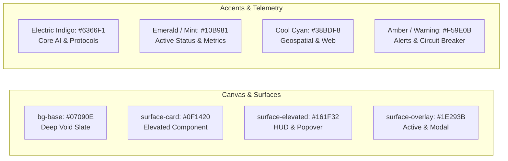
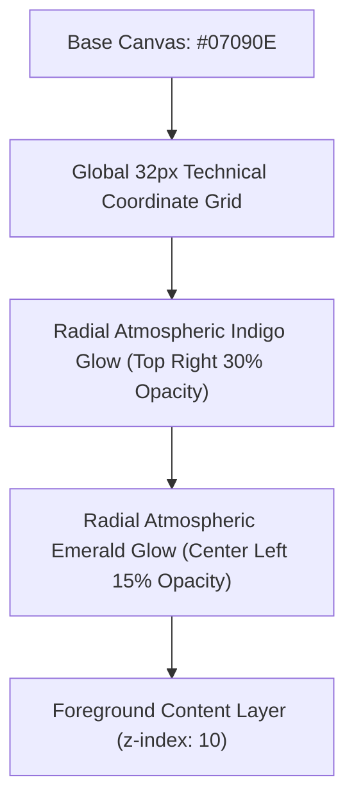
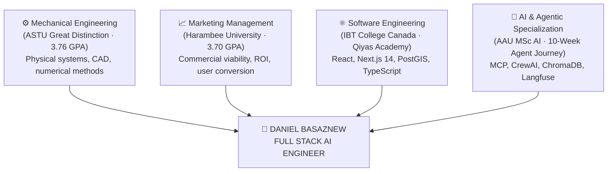
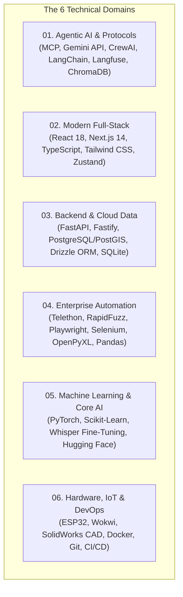
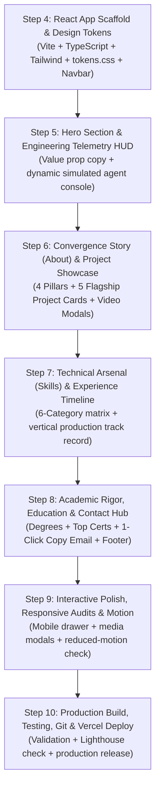

# Portfolio Visual Design System & React Architecture
**Project:** Daniel Basaznew — Personal Portfolio Website  
**Target Professional Title:** Full Stack AI Engineer  
**Stage:** Step 3 of 10 — Visual Design System, Design Tokens & React Architecture Specification  
**Source of Truth:** Portfolio Intelligence Report & Portfolio Architecture & Content Strategy Report  
**Implementation Target:** React (Vite / Next.js SPA) + Vanilla CSS / Tailwind CSS Design Tokens + TypeScript

---

## 1. Design Philosophy & Aesthetic Direction

### 1.1 The Visual Premise: "Production-Hardened Engineering HUD"
The portfolio's visual language is that of a **mission-critical engineering terminal / telemetry cockpit**. It rejects generic, colorful marketing fluff, corporate cookie-cutter templates, and hobbyist aesthetic tropes in favor of:
- **High-Density Technical Typography:** Clear hierarchy combining crisp geometric display fonts with precision monospace metadata.
- **Instrument-Grade Contrast & Surfaces:** Deep slate and charcoal foundations layered with subtle borders, muted grid lines, and directional glows.
- **Telemetry-Driven Storytelling:** Interfaces that present real system metrics, protocol declarations (`MCP stdio`), and latency/cost tracking rather than decorative shapes.
- **Architectural Convergence:** Visually unifying Daniel's mechanical systems background, commercial marketing acumen, and advanced software/AI specialization into a coherent story.

### 1.2 Inspiration vs. Originality
While inspired by the atmospheric depth, micro-interactions, and engineering telemetry of high-end developer portfolios (such as `azhar.com.pk`), this specification dictates a **completely original design system**:
- **Color Identity:** A distinctive charcoal/slate canvas accented by **Electric Indigo (`#6366F1`)** and **Emerald/Mint (`#10B981`)**, avoiding generic pure-black/pure-cyan palettes.
- **Component Geometry:** Sharp, technical container bounding with precision $1\text{px}$ borders (`border-white/10`) and subtle, restrained corner rounding ($4\text{px}$ to $8\text{px}$) rather than over-softened bubble cards.
- **Content Grounding:** Every HUD readout, telemetry module, and project card reflects Daniel's verified achievements (e.g. ASTU Great Distinction, 42+ unit tests, >80% PKF audit automation, 96.88% irrigation ML accuracy).

---

## 2. Color System & Design Tokens

The color palette is deliberately disciplined. High contrast and information hierarchy are achieved through luminosity, border definition, and typography rather than distracting rainbow washes.



### 2.1 CSS Variables / Design Tokens (`tokens.css`)

```css
:root {
  /* ==========================================================================
     CANVAS & SURFACE HIERARCHY
     ========================================================================== */
  --bg-base: #07090e;             /* Deepest canvas background */
  --bg-subtle: #0b0f19;           /* Secondary section canvas */
  --surface-card: #0f1420;        /* Base container & card surface */
  --surface-card-hover: #141c2e;  /* Interactive card hover state */
  --surface-elevated: #161f32;    /* Floating HUDs, modals, and toolbars */
  --surface-input: #0a0d14;       /* Input fields & terminal console viewports */

  /* ==========================================================================
     BORDER & DIVIDER TOKENS
     ========================================================================== */
  --border-subtle: rgba(255, 255, 255, 0.06);   /* Standard container outline */
  --border-medium: rgba(255, 255, 255, 0.12);   /* Interactive element borders */
  --border-strong: rgba(255, 255, 255, 0.20);   /* Active state borders */
  --border-indigo: rgba(99, 102, 241, 0.35);    /* Primary accent border */
  --border-emerald: rgba(16, 185, 129, 0.35);   /* Status accent border */

  /* ==========================================================================
     BRAND ACCENTS & TELEMETRY
     ========================================================================== */
  --accent-indigo: #6366f1;       /* Primary AI & Protocol Accent */
  --accent-indigo-hover: #4f46e5;
  --accent-indigo-glow: rgba(99, 102, 241, 0.15);

  --accent-emerald: #10b981;      /* Secondary Operational & Status Accent */
  --accent-emerald-hover: #059669;
  --accent-emerald-glow: rgba(16, 185, 129, 0.15);

  --accent-cyan: #38bdf8;         /* Supporting Full-Stack Accent */
  --accent-amber: #f59e0b;        /* Warning / Fallback indicator */
  --accent-rose: #f43f5e;         /* Error / Circuit Breaker trip */

  /* ==========================================================================
     TYPOGRAPHIC LUMINOSITY (CONTRAST GRADES)
     ========================================================================== */
  --text-primary: #f8fafc;        /* High-contrast headings & primary values */
  --text-secondary: #94a3b8;      /* Supporting body & descriptions */
  --text-muted: #64748b;          /* Metadata, line numbers & inactive tags */
  --text-dim: #334155;            /* Disabled text, fine dividers & grid lines */

  /* ==========================================================================
     GLOW & BOX SHADOWS
     ========================================================================== */
  --shadow-sm: 0 1px 2px rgba(0, 0, 0, 0.5);
  --shadow-card: 0 4px 20px rgba(0, 0, 0, 0.4), 0 0 0 1px var(--border-subtle);
  --shadow-hud: 0 8px 32px rgba(0, 0, 0, 0.6), 0 0 0 1px var(--border-medium);
  --glow-indigo: 0 0 30px rgba(99, 102, 241, 0.15);
  --glow-emerald: 0 0 30px rgba(16, 185, 129, 0.15);
}
```

---

## 3. Typography Specification

### 3.1 Typeface Selection
1. **Primary Display & UI Font:** `Space Grotesk` (Google Fonts: 400, 500, 600, 700)  
   *Role:* Section titles, hero headlines, card titles, navigation items. Provides a clean, modern, technical aesthetic with geometric character.
2. **Technical & Metadata Font:** `JetBrains Mono` (Google Fonts: 400, 500, 600)  
   *Role:* System telemetry readouts, code snippets, metadata tags, metric numbers, status pills, and HUD tables.
3. **Restrained Editorial Accent:** `Instrument Serif` (Google Fonts: 400, Italic)  
   *Role:* Used selectively on single accent words within major headlines (e.g. *"systems that survive* ***production***.*"*), providing sophisticated visual contrast.

### 3.2 Responsive Typographic Scale

| Element / Class | Typeface | Desktop ( $\ge 1024\text{px}$ ) | Tablet ($768\text{px} - 1023\text{px}$) | Mobile ($< 768\text{px}$) | Weight / Line-Height | Tracking |
| :--- | :--- | :--- | :--- | :--- | :--- | :--- |
| **Hero H1** | `Space Grotesk` | $56\text{px}\ (3.5\text{rem})$ | $42\text{px}\ (2.6\text{rem})$ | $32\text{px}\ (2.0\text{rem})$ | Bold (700) / $1.08$ | $-0.03\text{em}$ |
| **Section H2** | `Space Grotesk` | $36\text{px}\ (2.25\text{rem})$ | $30\text{px}\ (1.875\text{rem})$ | $24\text{px}\ (1.5\text{rem})$ | Bold (700) / $1.20$ | $-0.02\text{em}$ |
| **Card H3** | `Space Grotesk` | $22\text{px}\ (1.375\text{rem})$ | $20\text{px}\ (1.25\text{rem})$ | $18\text{px}\ (1.125\text{rem})$ | SemiBold (600) / $1.30$ | $-0.01\text{em}$ |
| **Section Eyebrow** | `JetBrains Mono` | $13\text{px}\ (0.8125\text{rem})$ | $12\text{px}\ (0.75\text{rem})$ | $12\text{px}\ (0.75\text{rem})$ | Medium (500) / $1.40$ | $+0.08\text{em}$ (Uppercase) |
| **Body Large** | `Space Grotesk` | $18\text{px}\ (1.125\text{rem})$ | $16\text{px}\ (1.0\text{rem})$ | $15\text{px}\ (0.9375\text{rem})$ | Regular (400) / $1.60$ | normal |
| **Body Regular** | `Space Grotesk` | $15\text{px}\ (0.9375\text{rem})$ | $14\text{px}\ (0.875\text{rem})$ | $14\text{px}\ (0.875\text{rem})$ | Regular (400) / $1.65$ | normal |
| **Metric Large** | `JetBrains Mono` | $36\text{px}\ (2.25\text{rem})$ | $30\text{px}\ (1.875\text{rem})$ | $26\text{px}\ (1.625\text{rem})$ | Bold (700) / $1.00$ | $-0.02\text{em}$ |
| **Code / Microtag** | `JetBrains Mono` | $12\text{px}\ (0.75\text{rem})$ | $12\text{px}\ (0.75\text{rem})$ | $11\text{px}\ (0.6875\text{rem})$ | Medium (500) / $1.30$ | $+0.04\text{em}$ |

---

## 4. Grid, Spacing & Layout Geometry

### 4.1 Grid Dimensions & Breakpoints
```text
Screen Sizes:
- Desktop Large: 1440px+ (Max container: 1240px)
- Desktop Standard: 1024px – 1439px (Container: 980px – 1180px)
- Tablet Landscape/Portrait: 768px – 1023px (Padding: 24px)
- Mobile Standard: 360px – 767px (Padding: 16px)
```

### 4.2 Spacing System (`rem` scale)
- **Section Spacing:** $96\text{px}$ desktop (`py-24`), $64\text{px}$ tablet (`py-16`), $48\text{px}$ mobile (`py-12`).
- **Card Padding:** $28\text{px}$ desktop (`p-7`), $20\text{px}$ mobile (`p-5`).
- **Component Gap:** $24\text{px}$ (`gap-6`) for primary grids; $16\text{px}$ (`gap-4`) for micro lists.

### 4.3 Border Radius & Structural Geometry
To maintain a high-tech engineering feel rather than an app-store consumer vibe, curvature is strictly constrained:
- **Primary Cards & HUD Panels:** $6\text{px}$ (`rounded-md`).
- **Interactive Buttons:** $4\text{px}$ (`rounded-sm`).
- **Micro Tech Pills & Badges:** $3\text{px}$ (`rounded-xs`) or sharp terminal tags with $0\text{px}$ radius.
- **Portraits & Media Modals:** $8\text{px}$ (`rounded-lg`).

---

## 5. Technical Background & Atmospheric System

The background must establish spatial depth without compromising contrast or text readability.



### 5.1 Reusable CSS Implementation (`BackgroundSystem.tsx`)
```css
/* Fixed Background Container */
.bg-canvas-container {
  position: fixed;
  inset: 0;
  pointer-events: none;
  z-index: 0;
  background-color: var(--bg-base);
  overflow: hidden;
}

/* Precision Technical Grid */
.bg-grid-overlay {
  position: absolute;
  inset: 0;
  background-size: 40px 40px;
  background-image: 
    linear-gradient(to right, rgba(255, 255, 255, 0.03) 1px, transparent 1px),
    linear-gradient(to bottom, rgba(255, 255, 255, 0.03) 1px, transparent 1px);
  mask-image: radial-gradient(circle at 50% 30%, black 40%, transparent 85%);
}

/* Ambient Radial Glows */
.bg-glow-indigo {
  position: absolute;
  top: -150px;
  right: -100px;
  width: 700px;
  height: 700px;
  background: radial-gradient(circle, rgba(99, 102, 241, 0.12) 0%, transparent 70%);
  filter: blur(80px);
}

.bg-glow-emerald {
  position: absolute;
  top: 50%;
  left: -200px;
  width: 600px;
  height: 600px;
  background: radial-gradient(circle, rgba(16, 185, 129, 0.08) 0%, transparent 70%);
  filter: blur(90px);
}
```

---

## 6. Global Navigation / Engineering HUD (`Navbar.tsx`)

### 6.1 Layout & Visual Behavior
- **Fixed Position:** Floating top navigation with backdrop-blur (`backdrop-blur-md bg-[#07090e]/80 border-b border-white/8`).
- **Left Slot:** Monogram logo mark `DB` with an electric indigo accent node.
- **Center Slot:** Monospace section links (`about`, `projects`, `skills`, `experience`, `contact`) with active section tracking via `IntersectionObserver`.
- **Right Slot:**
  - Live availability badge: `● OPEN TO FULL-TIME & CONSULTING` (blinking emerald dot).
  - GitHub Octocat icon link (`https://github.com/DanielBasaznew`).
  - Mobile hamburger toggle ($< 768\text{px}$).

### 6.2 Component Tree
```text
Navbar (Semantic <header>)
├── Container (max-w-6xl mx-auto flex items-center justify-between)
│   ├── Logo ([DB] Monogram with hover glow)
│   ├── NavLinks (Desktop <ul> with smooth anchor scrolling)
│   │   ├── NavItem ("#about")
│   │   ├── NavItem ("#projects")
│   │   ├── NavItem ("#skills")
│   │   ├── NavItem ("#experience")
│   │   └── NavItem ("#contact")
│   ├── NavStatus (Availability Indicator + GitHub Link)
│   └── MobileToggle (Button aria-expanded)
└── MobileDrawer (Collapsible full-screen drawer with large touch targets)
```

---

## 7. Hero Section System (`Hero.tsx` & `TelemetryHUD.tsx`)

### 7.1 Two-Column Desktop Architecture
```text
+------------------------------------------+------------------------------------------+
| LEFT COLUMN: THE VALUE PROPOSITION       | RIGHT COLUMN: THE TELEMETRY HUD          |
|                                          |                                          |
| [●] AVAILABLE · ADDIS ABABA / REMOTE     | +-- [HUD CONSOLE: ~/ai-assistant] -----+ |
|                                          | | STATUS: ACTIVE  PROTOCOL: MCP (stdio)| |
| Daniel Basaznew                          | | RUNTIME: Gemini Flash  P95: 142ms    | |
| FULL STACK AI ENGINEER                   | +--------------------------------------+ |
| "Building intelligent, production-       | | [LIVE SYSTEM TRACE]                  | |
|  hardened AI systems that bridge agents  | | > req_init: "Analyze AST codebase"   | |
|  to full-stack applications."            | | > mcp_tool: stdio_fs_search ("*.py") | |
|                                          | | > rag_retrieval: ChromaDB (0.94 sim) | |
| [Explore Systems ↓]  [Get in Touch ↗]    | | > circuit_breaker: nominal (0 trips) | |
|                                          | | > trace_dispatched: Langfuse ($0.07) | |
| +--------------------------------------+ | +--------------------------------------+ |
| | 10-WK AGENT | 42+ TESTS | >80% AUTOM | | | TOKENS/SEC: 1,280   COST: $0.075/1M  | |
| +--------------------------------------+ | +--------------------------------------+ |
+------------------------------------------+------------------------------------------+
```

### 7.2 The Telemetry HUD Component Specification (`TelemetryHUD.tsx`)
The right-hand column houses an **interactive engineering console** that cycles through simulated real-world telemetry events representing Daniel's capstone:
- **Card 1: System Status Matrix**
  - Protocol: `Model Context Protocol (MCP v1.2)`
  - Active Agents: `3 (CrewAI Research Team)`
  - Guardrail Status: `ARMED (Regex + Semantic Cache Gating)`
- **Card 2: Streaming Event Ticker**
  - Animated monospace log with timestamp, event source, and latency indicator.
  - Interactive tab switch allowing visitors to click: `[Agent Run]`, `[MCP Stdio]`, `[Vector RAG]`, or `[Langfuse Cost]`.

---

## 8. About & Convergence Section (`Convergence.tsx`)

Instead of a passive autobiographical paragraph, the section visually communicates **The 4 Engineering Pillars Converging into Full Stack AI Engineering**:



### 8.1 Visual Components
- **Pillar Grid (4 Cards):** Each pillar displays its academic/industry credential, core skills learned, and how it directly empowers Daniel's AI Engineering work today.
- **Convergence Node:** A central high-contrast summary box emphasizing: *"Physical systems discipline meets commercial perspective and autonomous software execution."*

---

## 9. Reusable Project Showcase System (`ProjectCard.tsx`)

Every featured project will be rendered using a consistent, high-density case-study card architecture:

```text
+-----------------------------------------------------------------------------------+
| 01 // AUTONOMOUS AGENT CAPSTONE                                    [PUBLIC REPO]  |
| AI Engineering Assistant                                                          |
| Autonomous multi-agent engineering assistant with MCP stdio, CrewAI & RAG.        |
+-----------------------------------------------------------------------------------+
| [42+ AUTOMATED TESTS]      [SUB-SECOND CACHE HIT]      [LANGFUSE COST TELEMETRY]  |
+-----------------------------------------+-----------------------------------------+
| PROBLEM:                                | SOLUTION:                               |
| Runaway agent tool-loops, context       | Hardened Gemini agent with stdio MCP    |
| pollution, and blind token spending.    | client, regex guardrails & circuit break|
+-----------------------------------------+-----------------------------------------+
| KEY CAPABILITIES:                                                                 |
| • Stdio Model Context Protocol (MCP) tool server integration                     |
| • ChromaDB vector RAG + SQLite long-term semantic memory                         |
| • Langfuse distributed tracing with fine-grained token cost accounting           |
+-----------------------------------------------------------------------------------+
| TECH: [Python 3.11] [Gemini] [MCP SDK] [Langfuse] [CrewAI] [ChromaDB] [SQLite]    |
+-----------------------------------------------------------------------------------+
| [GitHub Repository ↗]  [View Architecture Diagram]  [Interactive REPL Demo]       |
+-----------------------------------------------------------------------------------+
```

### 9.1 Flagship Projects Data Mapping
1. `ai-engineering-assistant`: Agentic AI, MCP, Observability, Testing Rigor.
2. `Azmera-Hub`: Full-Stack Next.js 14, Fastify, PostGIS, Agritech Logistics Monorepo.
3. `Retail Photo & Audit Combiner`: Multimodal AI, Telethon, RapidFuzz, Enterprise RPA (>80% workload cut).
4. `Asset Verification Dashboard`: Serverless Next.js 14, Drizzle ORM, Neon PostgreSQL, Recharts.
5. `AquaSense AI / Smart Irrigation`: Embedded ESP32, Scikit-Learn (96.88% accuracy), SolidWorks CAD, EAII Pitch.
*(Spotlight Callout: Whisper Speech Fine-Tuning for Amharic Shewa Dialect).*

---

## 10. Skills / Technical Arsenal System (`SkillsSection.tsx`)

Skills will be grouped into **6 distinct cards** arranged in a responsive grid. Arbitrary percentage bars are strictly prohibited.



### 10.1 Visual Hierarchy within Cards
- **Primary / Flagship Skills:** Rendered with a solid dark surface and subtle glowing border (e.g. `Model Context Protocol`, `Next.js 14`, `Drizzle ORM`).
- **Supporting / Auxiliary Skills:** Rendered as clean monospace text pills with muted borders.

---

## 11. Experience Timeline Architecture (`Experience.tsx`)

### 11.1 Vertical Timeline Layout
- **Node Spine:** A subtle $1\text{px}$ vertical line (`border-white/10`) with glowing status nodes for active roles.
- **Item Hierarchy:**
  - Date Range & Active Status Tag (`● ACTIVE`)
  - Organization & Location (`PKF Ethiopia · Addis Ababa / Remote`)
  - Role Title (`Workflow Automation Engineer & Field Audit Operations Lead`)
  - Executive Impact Summary
  - 3 Quantitative Accomplishment Bullets
  - Technology Tag Pill Cluster

---

## 12. Education & Credentials System (`Education.tsx`)

### 12.1 Academic Degrees (2x2 Grid)
1. **MSc in Artificial Intelligence** — Addis Ababa University (AAU) | Active Graduate Program
2. **BSc in Mechanical Engineering** — Adama Science & Tech University (ASTU) | **Great Distinction (3.76 Major GPA, Capstone A+)**
3. **BA in Marketing Management** — Harambee University | **CGPA: 3.70** (Concurrent study)
4. **Advanced Digital & Full Stack Software Development** — IBT College of Canada | Full-Stack & QA Program

### 12.2 Top 6 Verified Credentials (Compact Grid)
- Machine Learning Specialization (Andrew Ng / Stanford Online)
- Deep Learning Specialization (Andrew Ng / DeepLearning.AI)
- Generative AI with LLMs (DeepLearning.AI / AWS)
- Cursor AI Hackathon Certificate (Azmera-Hub Monorepo)
- Workflow Automation using Generative AI (Coursera)
- Python for Everybody Specialization (University of Michigan)
- *Collapsible Accordion:* "View Additional Academic Credentials & Certifications (e-SHE / ASTU Archive)"

---

## 13. Contact & Conversion Hub (`Contact.tsx` & `Footer.tsx`)

### 13.1 High-Conversion Contact Card
- **Headline:** *"Let's build intelligent systems that survive production."*
- **Response Commitment:** `< 24-Hour Guaranteed Turnaround`
- **Primary Action:** Large interactive email box displaying `basaznewdaniel@gmail.com` with a 1-click "Copy Email Address" button (showing animated feedback: `✓ Copied to clipboard`).
- **Quick Inquiry Templates:** Clickable pre-formatted mailto subject triggers:
  - `[Discuss Full-Time Role]`
  - `[Agentic AI Consulting]`
  - `[Technical Collaboration]`
- **Social / Channel Row:** Direct links to GitHub (`DanielBasaznew`), LinkedIn (`daniel-basaznew`), and Telegram.

### 13.2 Engineering Footer
- Monogram mark `DB`.
- System architecture declaration: `BUILT WITH REACT · TYPESCRIPT · TAILWIND CSS · NO TEMPLATES`.
- Timestamp & local Addis Ababa time display.

---

## 14. Motion & Micro-Interaction Principles

To ensure elite performance and eliminate distractions, animations follow strict guidelines:
1. **Section Reveal:** Lightweight fade-up ($20\text{px}$ translate, $0.4\text{s}$ duration, ease-out) triggered once via `IntersectionObserver`.
2. **Hover Elevation:** Cards elevate subtly ($-2\text{px}$ translateY) with border highlight transition ($0.2\text{s}$).
3. **Telemetry Activity:** Terminal ticker cycles simulated log entries at a comfortable reading pace ($3.5\text{s}$ interval).
4. **Accessibility (Reduced Motion):** All CSS and JavaScript transitions respect `@media (prefers-reduced-motion: reduce)`.
5. **Animation Library:** Recommend lightweight **Framer Motion** or zero-runtime **pure CSS animations** to keep bundle size minimal.

---

## 15. Responsive Breakpoint Rules

```text
+-------------------+--------------------------------------------------------------+
| VIEWPORT WIDTH    | STRUCTURAL BEHAVIOR                                          |
+-------------------+--------------------------------------------------------------+
| Desktop (≥1024px) | Full 2-column hero, side-by-side telemetry HUD, 2-column     |
|                   | project cards, 3-column skills grid, timeline spine active.  |
+-------------------+--------------------------------------------------------------+
| Tablet (768-1023) | Stacked hero with telemetry HUD positioned beneath copy;     |
|                   | 2-column skills grid; timeline cards stack vertically.       |
+-------------------+--------------------------------------------------------------+
| Mobile (<768px)   | Single column fluid layout; telemetry HUD condenses to       |
|                   | essential metrics; full-screen mobile navigation drawer;     |
|                   | horizontal scrolling for tech pill clusters if needed.       |
+-------------------+--------------------------------------------------------------+
```

---

## 16. Accessibility & Web Standards

- **Semantic Landmark HTML:** Proper use of `<header>`, `<main>`, `<section>`, `<article>`, `<nav>`, and `<footer>`.
- **Keyboard Operability:** Visible, high-contrast `:focus-visible` rings on all interactive links, buttons, and modals.
- **Color Contrast:** All body text meets WCAG AA standards ($\ge 4.5:1$ contrast ratio against dark surfaces).
- **Accessible Video Modals:** Trapped focus, `Escape` key close listener, and descriptive `aria-label` tags.

---

## 17. Proposed React Project Architecture

```text
portfolio/
├── public/
│   ├── favicon.svg
│   ├── images/
│   └── videos/
├── src/
│   ├── assets/               # Logos, icons, portraits
│   ├── components/           # Reusable UI primitives
│   │   ├── Badge.tsx
│   │   ├── Button.tsx
│   │   ├── Card.tsx
│   │   ├── Modal.tsx
│   │   ├── SectionHeader.tsx
│   │   └── VideoModal.tsx
│   ├── data/                 # Structured single source of truth
│   │   ├── projectsData.ts
│   │   ├── experienceData.ts
│   │   ├── skillsData.ts
│   │   └── educationData.ts
│   ├── hooks/                # Custom React hooks
│   │   ├── useActiveSection.ts
│   │   ├── useClipboard.ts
│   │   └── useReducedMotion.ts
│   ├── layout/               # Global shell components
│   │   ├── Navbar.tsx
│   │   ├── BackgroundSystem.tsx
│   │   └── Footer.tsx
│   ├── sections/             # Core page sections
│   │   ├── Hero.tsx
│   │   ├── TelemetryHUD.tsx
│   │   ├── Convergence.tsx   # About / 4 Pillars
│   │   ├── Projects.tsx      # Flagship Showcase
│   │   ├── ProjectCard.tsx
│   │   ├── Skills.tsx
│   │   ├── Experience.tsx
│   │   ├── Education.tsx
│   │   └── Contact.tsx
│   ├── styles/               # CSS variables and utilities
│   │   ├── tokens.css
│   │   └── globals.css
│   ├── types/                # TypeScript interface definitions
│   │   └── index.ts
│   ├── App.tsx               # Main SPA assembler
│   └── main.tsx              # Entry point
├── index.html
├── package.json
├── tailwind.config.js
├── tsconfig.json
└── vite.config.ts
```

---

## 18. Structured TypeScript Data Models (`types/index.ts`)

```typescript
export interface ProjectItem {
  id: string;
  index: string;                  // e.g. "01"
  category: string;               // e.g. "AUTONOMOUS AGENT CAPSTONE"
  title: string;
  tagline: string;
  problem: string;
  solution: string;
  proofMetrics: Array<{
    label: string;
    value: string;
  }>;
  keyHighlights: string[];
  technologies: string[];
  githubUrl?: string;
  demoUrl?: string;
  videoUrl?: string;
  statusBadge: string;            // e.g. "PUBLIC REPO", "LIVE DEMO"
}

export interface ExperienceItem {
  id: string;
  period: string;
  isActive: boolean;
  role: string;
  organization: string;
  location: string;
  summary: string;
  achievements: string[];
  technologies: string[];
}

export interface SkillCategory {
  id: string;
  categoryNumber: string;         // e.g. "01"
  title: string;
  coreSkills: string[];           // Highlighted with visual emphasis
  supportingSkills: string[];
}

export interface DegreeItem {
  degree: string;
  institution: string;
  period: string;
  honors?: string;
  details: string[];
}

export interface CertificateItem {
  title: string;
  issuer: string;
  credentialId?: string;
  isFlagship: boolean;
}
```

---

## 19. Performance Principles & Asset Budget

1. **Target Bundle Size:** Core JS payload $< 100\text{KB}$ gzipped.
2. **Font Optimization:** Self-hosted or pre-connected Google Fonts with `font-display: swap`.
3. **Asset Lazy Loading:** All project screenshots and demo videos load only when approaching the viewport (`loading="lazy"`).
4. **Zero Layout Shifts (CLS 0):** Explicit aspect ratios defined on all media containers.
5. **No Heavy Animation Engines:** Avoid massive 3D canvas libraries (Three.js/WebGL) in favor of lightweight SVG, CSS canvas, and CSS hardware-accelerated transforms.

---

## 20. Phased Implementation Roadmap (Steps 4 to 10)



---

*This document stands as the definitive visual and architectural specification for Step 4 of the portfolio build.*
